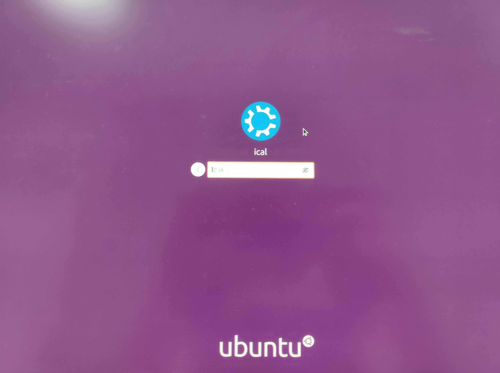

# SSH_Tutorial

## 1.簡介

* SSH全名Secure Shell，是一種加密的網路傳輸協定，SSH通過在網路中建立安全隧道來實現SSH客戶端與伺服器之間的連接。


## 2.主要用途

* 最常見的用途是遠端登入系統。

## 3.使用方法

```bash
ssh [使用者名稱]@[ip] (-p [port])
```
有點複雜，下面會一一說明
* ssh -> ssh程式的執行指令
* 使用者名稱 -> 想要連進去的電腦的使用者名稱

* @ -> 必加，當作用來分割的符號
* ip -> 想要連進去的電腦IP
* -p port -> 如果有多台電腦使用同一個IP，則需要指定通道(port)

## 4.範例
### 連進三樓實驗室門口那台電腦

* ssh -> ssh程式的執行指令
* 使用者名稱 -> ical
* @ -> 必加，當作用來分割的符號
* ip -> 三樓實驗室的IP : 140.127.205.179
* -p port -> 因為門口電腦配備RTX3090顯卡，因此我們在路由器上指定這台電腦的ssh port為30901

合併以上資訊可以得出以下命令
```bash
ssh ical@140.127.205.179 -p 30901
```


如果輸入成功，你可能會得到以下訊息
```bash
The authenticity of host '[140.127.205.179]:30901 ([140.127.205.179]:30901)' cant be established.
ECDSA key fingerprint is SHA256:Qsz6fWY58Jz8Sjleeit/Ie59JWI3pZVv8lGdlCVsGWk.
Are you sure you want to continue connecting (yes/no/[fingerprint])?
```

 

* 簡單來說

伺服器發給了你一張通行證，你如果想要安全的連線近來，之後就要用這張通行證，你是否要拿呢?(好啊/不要哩/我想要有個性一點的通行證)

* 複雜來說

伺服器會產生一組公鑰和一組私鑰，而「私鑰是用來破解由公鑰加密的訊息」。

接著伺服器會丟給你公鑰，跟你說：「你之後要傳訊息給我，一定要先用這組公鑰加密喔，因為能破解這串公鑰的私鑰只在我手上，就算公鑰加密的訊息被駭客竊聽了，沒有私鑰的駭客也沒有辦法得到原始訊息」

所以就輸入yes就好(要完整的yes，不能只打y)
```bash
Are you sure you want to continue connecting (yes/no/[fingerprint])?yes
```

然後你會看到

```bash
ical@140.127.205.179's password:
```


這裡輸入'你要連的電腦'密碼

實驗室的電腦密碼大多為ical406

最後，終端機的使用者名稱有變化，就代表成功啦!

